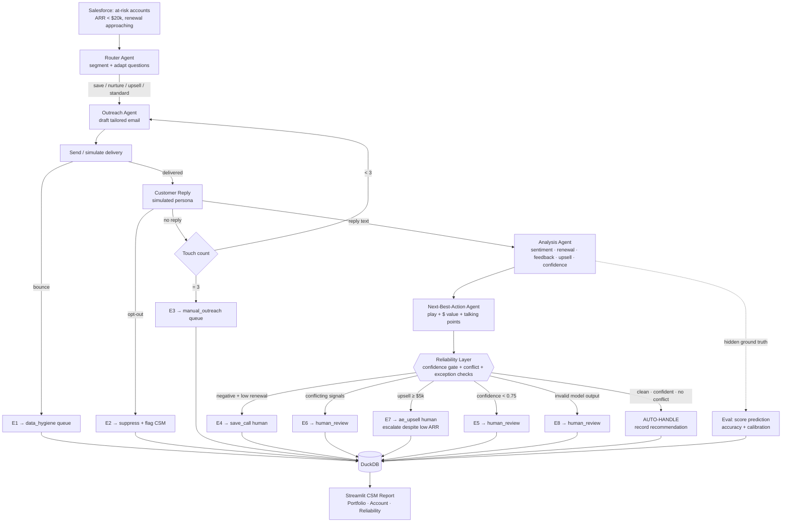

# Agentic Process Automation — Flow & Exception Handling

The closed loop, with every exception path. Renders on GitHub. This is deliverable #1.
The happy path is the spine; the branches off it are where the judgment lives.

## Reliability mechanisms layered on the flow
- **Schema validation + retry/fallback** at every agent (`agents/llm.py`): malformed output
  is retried with a stricter instruction, then falls back to a safe default that forces
  escalation (E8). The loop never crashes on a bad generation.
- **Confidence gate** (#003): only clean, confident, non-conflicting analyses auto-handle.
- **Exception taxonomy E1–E8** (`agents/reliability.py`): every off-happy-path case has a
  defined queue and reason, so nothing falls through silently.
- **Self-evaluation**: predictions are scored against hidden ground truth for an accuracy and
  calibration read — the proof the autonomy is earned, not assumed.

## The honest seam
Two things are simulated for the prototype: the Salesforce pull (replaced by `data_gen`) and
the customer reply (replaced by an LLM persona). In production: Salesforce is a real query and
the reply is a real inbound email/survey response routed back into the same loop. The eval's
offline accuracy is replaced by sampled human QA on escalations plus renewal-outcome
backtesting. **The mechanism — segment, engage, analyze, gate, escalate — is identical.**
